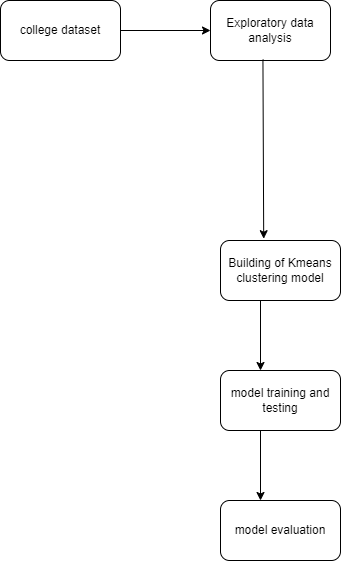

*Kmeans clustering Model*

Here we build kmeans clustering algorithm model on college dataset where we are predicting whether universities are private or not

**architecture**

**Steps**

***Step1 - git clone https://github.com/bheemancgnr/Machine-learning-models***

***Step2 - Run pip3 install -r requirements.txt***

***Step3 - Run python3 kmeans_clustering_project.ipynb to run the file***