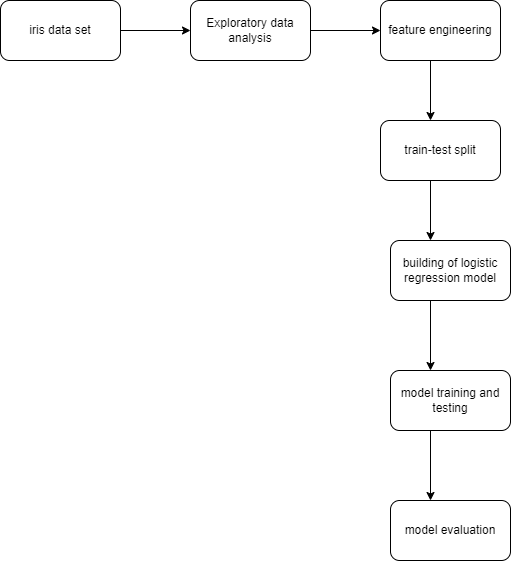

*KNN Model*

This is a k-nearest neighbour classification model on iris dataset.
It is a dataset to predict the iris of a dataset is iris-virginica,iris-setosa and iris-versicolor.

**architecture**

**Steps**

***Step1 - git clone https://github.com/bheemancgnr/Machine-learning-models***

***Step2 - Run pip3 install -r requirements.txt***

***Step3 - Run python3 KNN project.ipynb to run the file***