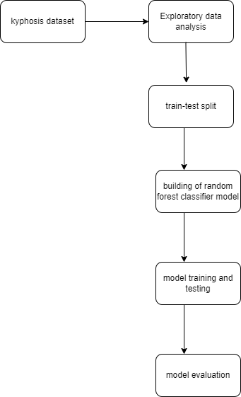

*Support Vector Machines Model*

Here we build Support Vector Machines algorithm on breast_cancer dataset.Here we are predicting whether a tumor is malignant or benign (Classification)

**architecture**

**Steps**

***Step1 - git clone https://github.com/bheemancgnr/Machine-learning-models***

***Step2 - Run pip3 install -r requirements.txt***

***Step3 - Run python3 svm.ipynb to run the file***